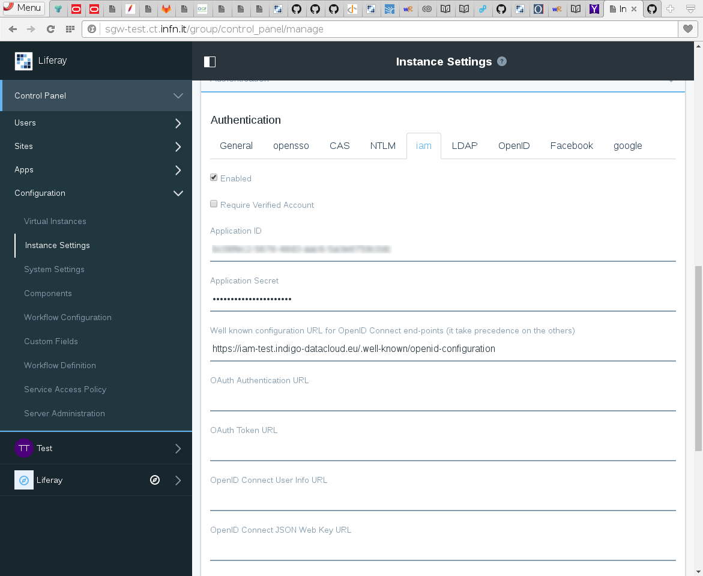
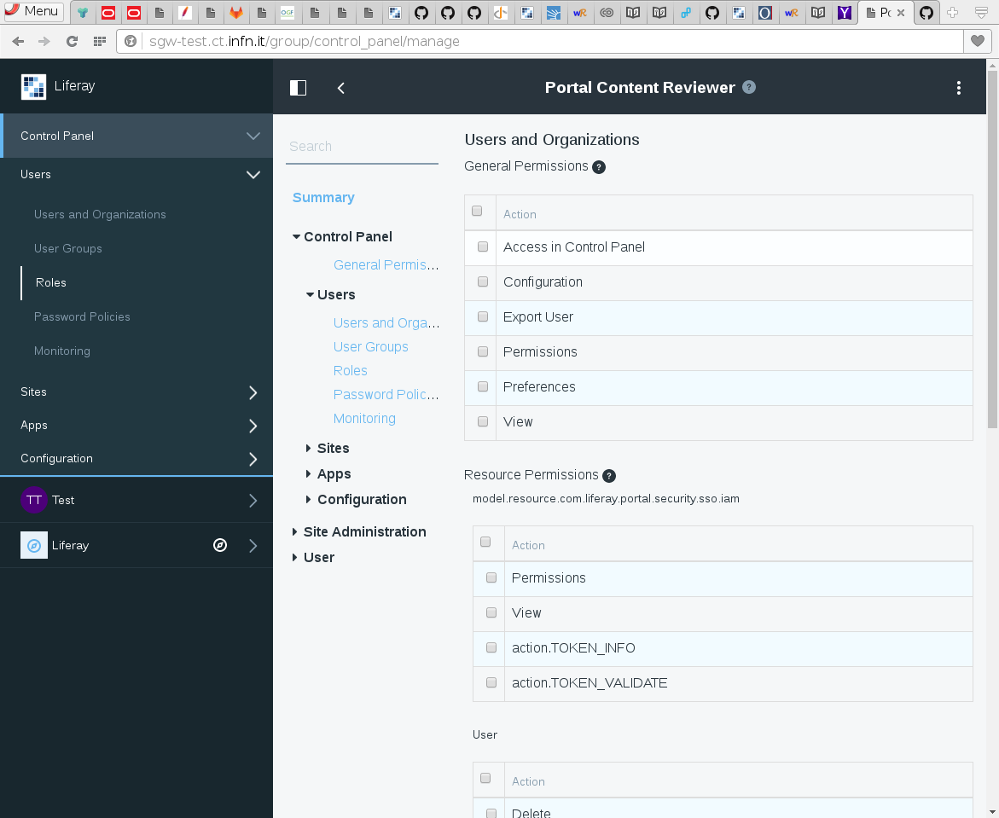

# Administration Guide

To deploy the LiferayIAM modules and make available INDIGO-AAI in Liferay the portal administrator has to upload into the portal
the five jar modules included in the release. The module upload page is available in `Liferay > Control Panel > Apps > App Manager`.

After the modules are deployed the new IAM authentication configuration should be available in the control panel going
to `Liferay > Control Panel > Configuration > Instance Settings`, under the section *authentication*. The following picture
shows the configuration made with the IAM-Test instance:

To work with the test configuration it is enough to provide the application identifiers (id and secret) and
the URL of the well known OpenId Connect configuration. For the IAM test the URL is:
[https://iam-test.indigo-datacloud.eu/.well-known/openid-configuration](https://iam-test.indigo-datacloud.eu/.well-known/openid-configuration)

Administrator can require some extra scopes for the token. The default configuration requires only the scopes for the user
identification as requested by Liferay (name, mail and other attributes) and the refresh token.

Checking the enable check will make the authentication method available to the user.

Some application could require to access to reserved remote methods provided by the modules (to retrieve user token and/or
validate them). The access to these methods is possible only from authorised accounts.
The best way to provide the authorisation is to create a special role and assign this rule to the user or a group of users
associated with the applications requiring the permissions. The role has to enable the access
to this method. This can be configured going to the page `Liferay > Control Panel > Users > Roles`. In the page the administrator
can create a new role and then open the `Define Permissions` dialog which will show the authorisation for the iam related method under the *Users and Organisations* group, as shown in the following picture:

Enabling the permissions for the `model.resource.com.liferay.portal.security.sso.iam`, among the *Resource Permissions*,
everyone with this role can access the remote methods.

Finally, to make the user subject and token visible to the owner among the account value the custom fields must be enabled. The fields
to enable are *Iamaccesstoken*, *Iamrefreshtoken* and 	*Iamuserid* and thes are available in the menu `Liferay > Control Panel > Custom Fields`
selecting the *User* resource. To make them visible select the permissions configuration and enable the view to the **User**. Ager the
users should find these three fields among their custom fields in the account configuration pages.

## Upgrade to a new release

To upgrade to a new release of LiferayIAM it is enough to install the new module following the same procedure of the installation.
However, all previous configurations will remain untouched and applied to the new version.

> **NOTE:** in some Liferay versions upgraed modules are not removed but they will remain actives side by side with the new version.
> A [bug](https://issues.liferay.com/browse/LPS-68275) has been reported in Liferay for the tested version. Therefore, before to
> upgrade it is better to remove the previous version of LiferayIAM modules. This requires two steps:
>
> * Access the `App Manager`, search for `iam` and remove the five related modules.
> * Stop Liferay, remove the corresponding jar files from the `osgi/modules` folder in your installation and restart Liferay.
>
> The modules should not be present anymore but the configuration is still stored so after the installation of the new modules the authentication
> will return to work as before.
