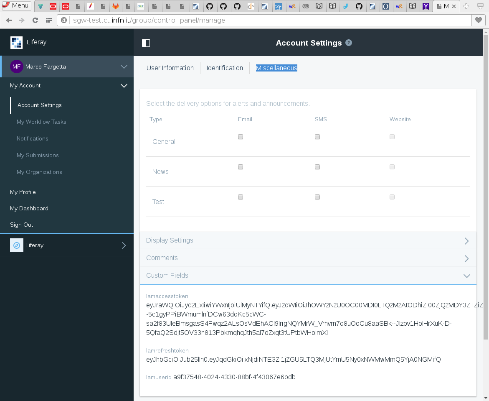

# User Interface

When the modules are deployed and properly configured the user interface change in few component. The login portlet
will include, among the other enabled protocol, the new *INDIGO AAI* authentication method, as shown in the following picture:

If the user click on *INDIGO AAI* a pop-up windows is created with the IAM login page. After the login the pop-up page
is automatically closed and the user is authenticated.

The first time the user authenticate has to provide the consensus to release the tokens to the Liferay based application. This
request is performed twice: once for the access token and the other for the refresh token. Following authentication will
require the user consensus only if the requested scopes will change.

Finally, the user can verify the tokens released by IAM going to his/her personal account page. In the *My Account* page,
under the tab *Miscellaneous* there are the *Custom Fields* attributes. IAM tokens are among the custom fields as shown in the
following picture:

